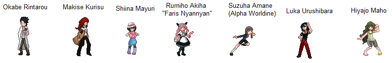

# Steins;Gate GameBoy
- 🛠️ Currently in development.
[Download the Steins Gate v0.2.0 Alpha Version](https://github.com/TheSGJ/SteinsGate-GameBoy/releases/download/v0.2.0-alpha/SteinsGate.gb)

### Running The Game:
- You can download the game from the above link. And You can run it on My Old Boy on android, & on Visual Boy Advance for System. 

### Developing The Game:
[DownLoad GameBoy Tile Designer](http://devrs.com/gb/hmgd/gbtd22.zip)

[Download bgb emulater for GameBoy recommended for development purposes](http://bgb.bircd.org/bgb.zip)

## Steins Gate GameBoy Game Characters

